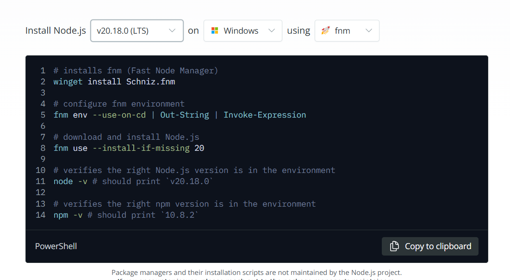

# Flask-VueJs-Grocery App 🎓
This repo is for mad2 full stack application using flask and Vue. These 7 days bootcamp will guide how to create full stack grocery app using flask &amp; Vue along with supporting libraries.

_Flask + Vue.js Web Application Template_

 

## Table of Contents

<!--ts-->
   * [Getting started](#getting-started) 
        * [Tools](#tools)
        * [Frameworks](#frameworks)
<!--te-->

## Getting started
### Tools
* Install WSL `Only for windows users(download WSL2 with default linux distribution). Mac and Linux user can skip this` [visit link to download and setup](https://learn.microsoft.com/en-us/windows/wsl/install)
* Git `latest stable version`[visit link to download and setup](https://git-scm.com/)
* VS Code `with extensions` [Vue-Official, Live Share, WSL]
* Nodejs `For windows users:install for wsl` [visit link to download and setup](https://nodejs.org/en/download/package-manager)

* Vite `command line build tool` [visit link install](https://vite.dev/guide/)
* Redis `In Memory Database Message Broker` [visit link install](https://redis.io/docs/latest/operate/oss_and_stack/install/)
* MailHog `Tool for testing mail server` [visit link install](https://github.com/mailhog/MailHog)
* Vue Devtools `Search in browser web store and add the extension`

### Frameworks
* VueJS `Vue3 Options API` [link](https://vuejs.org/)
* Vue Router `v^4` [link](https://router.vuejs.org/introduction.html)
* PrimeVue `v^4` [link](https://primevue.org/introduction/)
* Bootstrap `v^5` [link](https://getbootstrap.com/)
* Vuex `v^4` [link](https://vuex.vuejs.org/)
* Flask `v^3` [link](https://flask.palletsprojects.com/en/3.0.x/)
* Flask-jwt-extended `v^3` [link](https://flask-jwt-extended.readthedocs.io/en/stable/)
* Flask-Cors `v^3` [link](https://readthedocs.org/projects/flask-cors/downloads/pdf/latest/)
* Flask-Restful `latest` [link](https://flask-restful.readthedocs.io/en/latest/)
* Flask-Mail `latest` [link](https://flask-mail.readthedocs.io/en/latest/)
* Flask-SSE `latest` [link](https://flask-sse.readthedocs.io/en/latest/)
* Flask-SQLAlchemy `latest` [link](https://flask-sqlalchemy.palletsprojects.com/en/latest/)
* Flask-Caching `latest` [link](https://flask-caching.readthedocs.io/en/latest/index.html)
* Celery - Distributed Task Queue `stable` [link](https://docs.celeryq.dev/en/stable/)